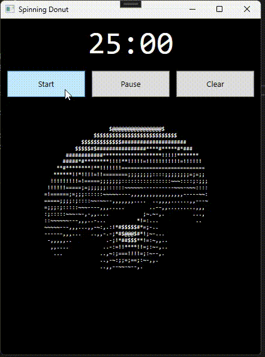

# Spinning Donut Pomodoro Timer

A lightweight WPF desktop application featuring a 3D ASCII spinning donut animation and a simple, clean Pomodoro-style timer. Designed to stay minimal, centered, and distraction-free.

---

## Overview

This application provides:

- A 25-minute focus timer with Start, Pause, and Clear controls  
- A real-time ASCII donut animation rendered using 3D rotation and shading  
- Independent scaling for the UI and the donut display  
- A clean layout that avoids overlap or distortion at various window sizes  

The project is built in C# using WPF (.NET), with the animation handled by a custom rendering class.

---

## Example Screenshot

